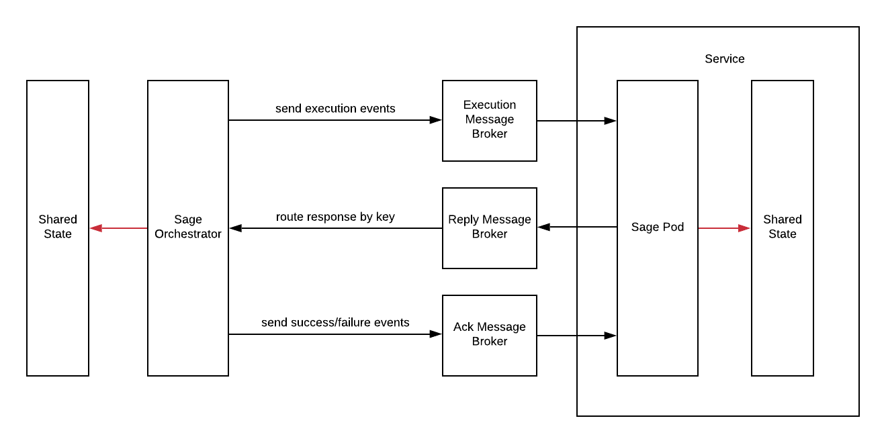

# Sage Architecture

Sage is implementation of Saga pattern, consisting of 2 components:

- Sage Orchestrator
  
- Sage Pod

### Sage Orchestrator 

  + Manage orchestration
  + Execute orchestration
  + Handle response from Sage Pods
  + Send success/failure events to Sage Pods
  + Support fault tolerant, timeout handling

### Sage Pod

  + Receive orchestration events from Sage Orchestrator
  + Receive success/failure events from Sage Orchestrator
  + Support idempotent, timeout handling, late events...
